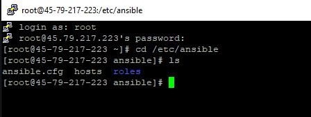
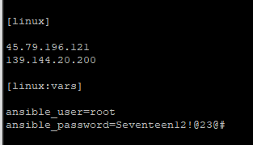
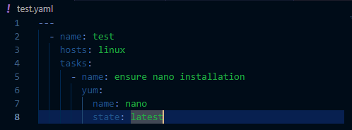

# Ansible Ascertained

## What is it?
Ansible is basically the CEO of a network, and is the point of automation.

## What does it do?
- Configure systems (both OS systems and networking devices)
- Deploy software
- Supports continuous deployment/upscaling
- Allows for zero-downtime updates
- Uses OpenSSH for communication between systems
- Agent-less, meaning no software is required to be installed on client

## How does it work
Ansible pushes commands to devices, it uses the credentials of the systems OS. When installed, ansible will have a directory with a configuration for ansible processes as well as an inventory of all its connected devices.
The control center is utilized through a CLI, and is where playbooks, or files that have a list of tasks that Ansible will carryout through all devices.

### Accessing Ansible Directory

### Connecting Devices to Ansible Inventory
1. access the "hosts" file
2. insert "[group name]" then ip of devices to configure
3. make sure ansible has the right credentials to access these devices using "[group-name:vars]"

### Ansible CLI commands
ansible command example: **ansible linux -m ping**

ansible tags:
- "-a" (ad-hoc command)
- "-m" (module)

### Ansible Playbooks
**Playbooks** will contain **plays** that contain **tasks** that contain modules that are programs.
- example of a module is the "apt" on Ubuntu or the "yum" on CentOS

playbooks are the .yml extension

Ansible is idempotent meaning, if the result of performing it once, is exactly the same as the result of performning it repeatedly, without any intervening actions.

