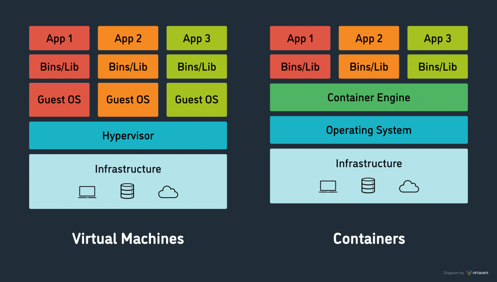

<h1>Docker Decrypted</h1>
  

    Hopefully this can shed light onto how to get started fiddling with Docker, while also being capable of explaining to others what you're doing exactly. Docker is a container software, in contrast to a 
    hypervisor has its own pros and cons.
  

  
<h2>What is it?</h2>
<ul>
  <li>
    Docker essentially assigns cubicles (containers) to an office space (the resources) where workers (applications) may conduct tasks.
    The workers are not allowed to use the stapler in the cubicle next door, since they are assigned strictly to their cubicle.
  </li>
   
  <li>
    Docker attaches itself to the OS system on your hardware. It uses the resources provided by the OS of choice to provide the user with the ability to separate your OS into smaller versions of itself.
    These smaller versions are then capable of acting like a new computer, ready to use its logical processing unit for any process/application that the user would like for it to specialize in.
  </li>
   
  <li>
    In contrast, a hypervisor would be directly on top of the hardware. What this means is that for every cubicle (container) that is provisioned, the hypervisor must build an entire office. Rather than have multiple    
    offices with one cubicle. Docker, a container engine would consolidate those cubicles into one office. 
  </li>
   
  
</ul>

<h2>Pro and Cons</h2>
<ul>
  <li>
    Since each container uses its own allocated resources, this allows for applications to be run on their own, reducing incompatibility and conflict of interest for hardware usage
  </li>
   
  <li>
    Docker is extremely fast and lightweight, meaning that containers can be configured, updated, and run much faster than other container softwares
  </li>
   
  <li>
    A negative with docker is that windows cannot be run as a container with a linux based docker and vice versa.
  </li>
</ul>

<h2>There are generally 7 main networking methods:</h2>
  <ol>
    <li>
      The default bridge - akin to setting up a switch for containers to which the switch talks to the docker network interface as its router
    </li>
     
    <li>
      The user-defined bridge - basically creating another bridge, or another network allowing for two separate networks that communicates to the same router; supports DNS-like connection between each container
    </li>
     
    <li>
      MACVLAN - all of the benefits of a bridge network but acts as if its directly connected to home network using the host interface, meaning promisc must be enabled; downside being no DHCP  
    </li>
     
    <li>
      IPvlan(Layer 2) - similar to MACVLAN but the mac address of the host will be shared to the container with the container(s) having their own ip address; circumvents the promisc issue   
    </li>
     
    <li>
      IPvlan(Layer 3) - connecting containers to host as if the host is a router, but this time networking is done on the third layer, passing over broadcasting issues; gives user more control     
    </li>
     
    <li>
      Overlay Network - used for multiple hosts running multiple containers across multiple machines, usually using Docker Swarm; Very cloud centric   
    </li>
     
    <li>
      None - literally nothing, but allows for certain containers to act as isolated as possible from any machine.   
    </li>
   </ol> 
